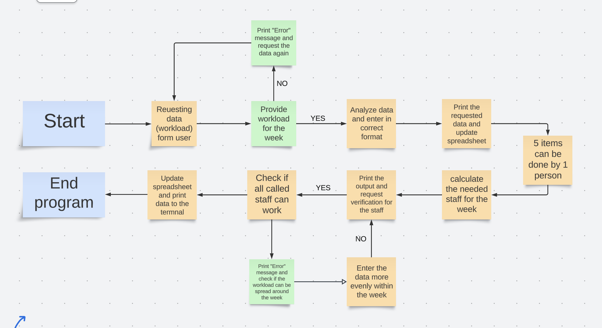

# Working Schedule

Working Schedule is a simple and efficient way to manage weekly staff schedules based on workload and availability. The program collects workload data from users, calculates the necessary staff needed for each day, and updates multiple Google Sheets to reflect this information.

It handles inputs for each day of the week, checks staff availability, and provides a clear output of the required staffing. Additionally, it organizes data in an easily referenceable format, automating the generation of weekly working schedules based on team capacity and workload distribution.

Integrating with Google Sheets allows for real-time updates, ensuring the schedule reflects the latest staff availability and task requirements. Each team member can manage 5 tasks per day, enabling the system to calculate and assign the appropriate number of staff per day. It also generates a random schedule based on the provided information.

[Link to Working Schedule](https://working-schedule-31944893274f.herokuapp.com/)

---
## Logic flowchart

* The flowchart demonstrates the flow of data and decision-making in the program. It starts with the input of daily workloads and ends with the generated schedule being updated in Google Sheets.
---

## User Experience (UX)

The Working Schedule system is designed to provide a seamless, efficient experience for users responsible for managing staffing schedules. The interface allows users to input workload data, see the required staff members for the week, and ensure that the schedule is balanced based on staff availability. The output is automatically updated into Google Sheets, making it easy to review and adjust staffing plans on the fly.

### Key aspects of the user experience:

* Simplicity
  * The system minimizes manual effort by calculating the necessary staff based on workload inputs and predefined rules, such as staff availability.
* Automation
  * Users benefit from automated Google Sheets integration, which ensures that schedules are saved, accessible, and shareable across the organization.
* Error Handling
  * If the workload exceeds the available staff, the program provides feedback, prompting the user to make necessary adjustments.
* Efficiency
  * By using this system, users can focus more on operational management rather than manual schedule creation.

### User Stories

* First-time User Goals
  * Understand how the system works: The user should quickly understand how to input the workload data, and how the staff scheduling is calculated and updated into the Google Sheet.
  * Create their first schedule: Once the user understands the process, they should be able to input the weekly workload and generate a staff schedule without confusion.
  * Experience seamless integration: The first-time user should see how easy it is to update the schedule and view it in Google Sheets, helping them manage staff schedules efficiently.
* Returning User Goals
  * Continue scheduling efficiently: The returning user will likely want to input new workload data for future weeks and generate updated schedules without needing further guidance.
  * Adjust workload based on feedback: Returning users may refine their workload input based on previous feedback from the system, like insufficient staff, ensuring smoother operations.
  * Explore new features: Users might want to explore additional features such as saving historical data or generating reports for staff allocation over a month.
* Frequent User Goals
  * Optimize staff allocation: Frequent users may focus on optimizing staff usage, reducing over-scheduling, or ensuring that no team members are overworked.
  * Share the schedule with colleagues: Users who handle scheduling regularly will likely share the schedules with team members and supervisors, ensuring that everyone is aligned with the workload.
  * Save and analyze data: Frequent users may want to save weekly data to analyze trends, staff utilization rates, and workload distribution across multiple weeks to improve long-term planning.

## Features

* Automated Weekly Schedule Generation: Automatically calculates the number of staff required per day based on workload and assigns staff to tasks.
* Google Sheets Integration: The schedule is updated in a Google Sheet for easy access and real-time collaboration.
* Customizable Workload Inputs: Easily input workload data, and the system will adjust the staffing requirements accordingly.
* Dynamic Updates: The schedule adjusts automatically if there are changes in workload or staff availability.
* Week Number Tracker: Automatically appends the week number to each data row for better tracking.

### Existing Features

* Intro screen
 ** (Img main screen)
* Adding week number
 ** (img adding wk nr)
* Reuesting data for each day if the week 
 ** (img when data is requested)
* Correct input
 ** (img when input is correct)
* Incorrect input 
 ** (img when input is incorrcet)
* Print the calculated data
 ** (img of data printed in app)
* Updates Google Sheets wirth correct data 
 ** (img of google sheet after update)
* Generates working schedule based on availability and calculated data 
 ** (img of examp schedule)

### Features Left to Implement 

* Data to be deleted with request by the user in the app instead of manually by the user
* More staff to be added so more worlkoad can be done 
* Option to choose the amount of tasks that can be done by one individule. 

---
# Technologies Used

* Python: The primary programming language used for logic and automation.
* Google Sheets API: For seamless integration and updating of the schedule in Google Sheets.
* gspread: Python library used to interact with Google Sheets.
* OAuth2: Used for authentication with Google Sheets.
---
## Fixed Bugs
* The program run twice as one func has been called twice , once in main and once at the end of the program, which was fixed by removing the get_schedule_data() func called after main()
* KeyErorr was present due to incorrect header spelling in spreadsheet and the data could not be extracte. Fixed by correcting the misspelled data. 
* Was not updating spreadsheet with the required information, fixed by placing needed_staff[day] = staff outside the "if" block to ensure calculated staff count is correctly assigned to the needed_staff dictionary for all cases.

## Frameworks, Libraries & Programs Used

* [GitHub](https://github.com/)
    * To write the code.
* [Github](https://github.com/)
    * Deployment of the website and storing the files online.
* [LucidApp](https://lucid.app/)
    * To create a logic flowchart of the hangman game.
* [Heroku](https://www.heroku.com/)
    * To deploy the project.
* [CI Python Linter](https://pep8ci.herokuapp.com/)
    * Check code for any issues.

## Deployment

### Deploying to Heroku

To deploy with Heroku, Code Institute Python Essentials Template was used so the python code can be viewed in a terminal in a browser
1. Log in to Heroku or create a new account
2. On the main page click "New" and select "Create new app"
3. Choose your unique app name and select your region
4. Click "Create app"
5. On the next page find "settings" and locate "Config Vars"
6. Click "Reveal Config Vars" and add "PORT" key and value "8000", click "Add"
7. Scroll down, locate "Buildpack" and click "Add", select "Python"
8. Repeat step 7. only this time add "Node.js", make sure "Python" is first
9. Scroll to the top and select "Deploy" tab
10. Select GitHub as deployment method and search for your repository and link them together
11. Scroll down and select either "Enable Automatic Deploys" or "Manual Deploy"
12. Deployed site (link to deployed site)

### Forking the GitHub Repository

By forking the repository, we make a copy of the original repository on our GitHub account to view and change without affecting the original repository by using these steps:

1. Log in to GitHub and locate [GitHub Repository Working Schedule](https://github.com/TinaGrigorova)
2. At the top of the Repository(under the main navigation) locate "Fork" button.
3. Now you should have a copy of the original repository in your GitHub account.

### Local Clone

1. Log in to GitHub and locate [GitHub Repository Working Schedule](https://github.com/TinaGrigorova)
2. Under the repository name click "Clone or download"
3. Click on the code button, select clone with HTTPS, SSH or GitHub CLI and copy the link shown.
4. Open Git Bash
5. Change the current working directory to the location where you want the cloned directory to be made.
6. Type `git clone` and then paste The URL copied in the step 3.
7. Press Enter and your local clone will be created.

## Credits

### Code

* I gained understanding of python through code institute lessons.
* Python 3.11.3 documentation.

### Content

* All content was written by the developer.

## Acknowledgements

 * My mentor Mitko Bachvarov provided helpful feedback.
 * Slack community for encouragement.